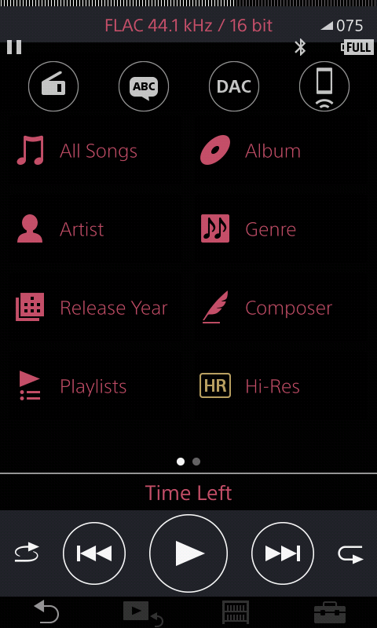
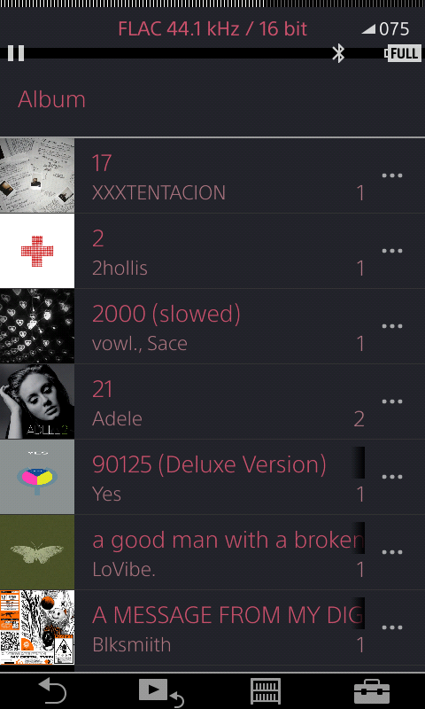
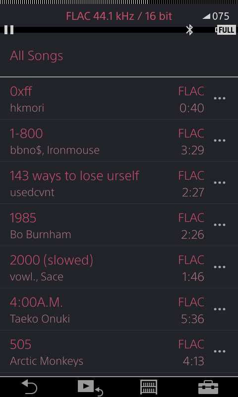
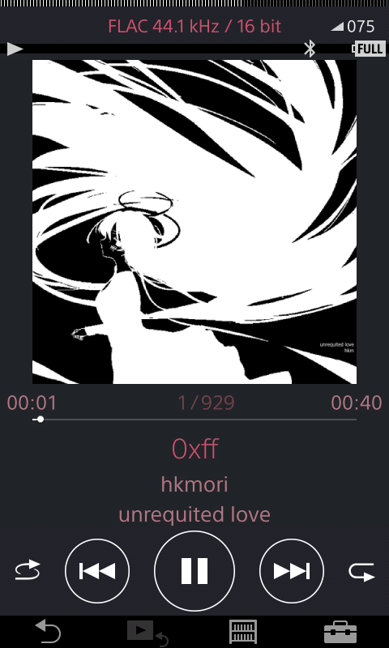

# WLKMN Studio

App & Docs created with assistance from Anthropic Claude. Patches found manually in Ghidra. (i cant code UI or write well lol)

**Make your Sony Walkman *yours*.** Recolor the whole interface, swap the boot animation, power-on logo
and font, tune the audio, and kill the annoying "Creating Database" scan on every boot — all from a
simple app on your computer, with **one-click undo** for everything.

Works on a **[Walkman One](https://www.mrwalkman.com/)** (rooted) NW-A30/A40/A50. Free and open-source.
**[wlkmn.studio](https://wlkmn.studio)**

> ⚠️ **Please read:** this modifies system files on your Walkman, so there's always *some* risk — a bad
> flash can cause a boot loop. Every change is backed up first and can be undone, and the built-in
> **Bootloop Recovery** tool re-flashes a known-good player app — which covers the most common loop (a
> bad theme / player-app flash). Deeper trouble, like a bad partition or full-firmware flash, is outside
> its scope and needs re-flashing firmware. So go carefully. It's never bricked a device in testing —
> no promises, though. Use at your own risk.

---

## Screenshots
The stock UI, recolored with the **UI Text Themer** + **UI Accent** mods (crimson here — pick any colors):

  
  
  
  

*(yes the music's a bit weird — I dumped ~30 playlists from friends 😅)*

---

## Install & run

**The only thing you install is Python — the app grabs everything else (including adb) by itself.**

1. **Install Python** from [python.org/downloads](https://www.python.org/downloads/)
   *(Windows: tick “Add python.exe to PATH” in the installer).*
2. **Download WLKMN Studio:** green **Code → Download ZIP**, then extract the ZIP.
3. **Double-click the launcher** in that folder:
   - **Windows** → `START.bat`
   - **macOS** → `start.command`
   - **Linux** → `start.sh`

The first run sets things up (a minute or two) and then the app opens. That's it.

👉 **Non-techy? Full step-by-step with pictures → [INSTALL.md](INSTALL.md).**

---

## How to use it
1. **Plug your Walkman into the computer** with USB. Leave the player screen up — **don't** turn on
   *USB Mass Storage*. (There's no “USB debugging” to enable; Walkman One handles the connection.)
2. When the bar at the top of the app turns **green**, you're connected.
3. **Pick a mod → Preview → Apply → ⟳ Reboot** to see it on the device.
4. Changed your mind? Every mod has a **Revert** button (or **Revert All**). Then reboot.

**If a theme or player-app flash leaves it stuck rebooting:** don't panic — hit the red **🚑 Bootloop
Recovery** button, keep it plugged in, and it re-installs a known-good player app to get you booting
again. (A bad splash / boot-animation / font is fixed with **Revert All** once you're back; a
full-firmware problem needs re-flashing firmware.) Everything you flash is backed up + verified first.

---

## What's inside

**🎨 Theme**
| Mod | What it does |
|---|---|
| **Theme Packs** | Pick a whole coordinated look — **Crimson / Mono / Ocean / Amber** — and it recolors text, background **and** icons in one click. Easiest way to reskin. |
| **UI Text Themer** | Recolor *all* the menu/track text + background — pick any color per element, or a 1-click preset |
| **UI Accent + Icons** | Recolor the home-screen icons + the EQ/streaming accent |
| **Boot Animation** | Replace the startup animation with your own GIF (or a logo→waves intro) |
| **Power-on Splash** | Replace the orange WALKMAN logo |
| **UI Font** | Swap the interface font for a bundled or uploaded typeface |
| **Alternate Theme** · **Marquee Scroll Speed** | Flip to the firmware's 2nd palette · tune title-scroll speed |

**🔊 Audio**
| Mod | What it does |
|---|---|
| **LDAC 990** | Force LDAC to its top 990 kbps and stop it auto-dropping quality |
| **SBC-XQ** | Higher-quality SBC for any Bluetooth headphones |
| **AirPods / A2DP Fix** | Fixes AirPods (and similar) that cut out over Bluetooth |
| **BT Monitor** | Live read of what Bluetooth codec is actually playing |

**⚡ Quality of life**
| Mod | What it does |
|---|---|
| **Fast Boot (skip DB scan)** | Kills the “Creating Database” scan that blocks **every** boot — while USB transfers still rescan your library automatically. The big one. |
| **Clock Fix** *(legacy)* · **Clean Junk** | Fix the "stuck in 2018" clock that forces DB rebuilds — Fast Boot usually covers this now · tidy Mac/Windows junk off the card |
| **Library Stats** · **Find Duplicates** · **Storage Info** · **Boot Log** | Read-only info tools |

**⚙️ System** — Walkman One Settings (sound sig / region / gain…), NVP Flags, Full Backup, Reboot / Restart UI.

The top bar also has **🚑 Bootloop Recovery**, live **Screenshot**, **Save/Load Profile**, and **Revert All**.

---

## Will it work on my Walkman?
It targets Sony's non-Android “Walkman OS” players running **Walkman One**. Developed and tested on the
**NW-A55**. Mods check their exact target first and **abort cleanly instead of bricking** if a model
differs, so trying is low-risk.

| | Models |
|---|---|
| ✅ **Tested / expected** | NW-A50 (A55/56/57), NW-A40 (A45/46/47), NW-A30 (A35/36/37) — *A30/A40 have no LDAC, skip that mod* |
| 🟡 **Same platform, audio patches vary** | NW-ZX300 / ZX300A, NW-WM1A / WM1Z — theme + QOL should port |
| ❌ **Not supported** (different OS) | NW-A100, NW-ZX500, NW-A300 (Android) |

**Requires Walkman One + root.** You only need **Python** installed — the app fetches adb itself.

### Plays nice with [wampy](https://github.com/unknown321/wampy)
wampy skins the *player* (Winamp/cassette overlays, EQ); WLKMN Studio themes the *system* UI, boot
animation, splash and fonts. They don't touch the same files. Install **wampy first, then WLKMN mods**.

---

## Under the hood
Everything operates on *your* device's own files (**no proprietary Sony files are shipped**) — the app
pulls each original, patches it, verifies the result by md5, and keeps a backup so **Revert** always
works. The deeper mods (the text palette, LDAC, the Fast Boot patch) were reverse-engineered with Ghidra.
Prefer a terminal? There's a full CLI — run `python -m wlkmnstudio.cli list`.

## Roadmap
EQ / DSP presets · force bit-perfect (Source Direct) · AAC max bitrate · live codec/bitrate HUD ·
volume-bar theming · web gallery at **wlkmn.studio**.

## Credits
Base firmware: **Mr Walkman / Walkman One**. Companion tooling: **unknown321** (wampy, fix-coverart, wbrt).
Format references: `bgcngm/mtk-tools`, `rom1nux/mtkimg`, `roobscoob/SonyWalkmanFirmwarePatcher`,
`97lily/2019_android_walkman`.

## License
MIT — free to use, change, and share.
